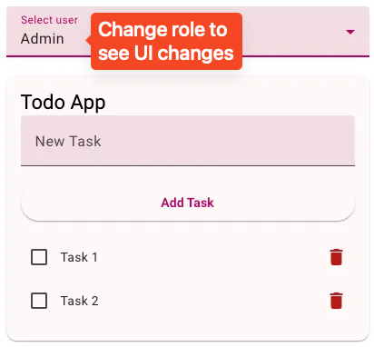

## Serving Angular Frontend

1. Install project dependencies with `npm install`
2. Run `npm run start` for a dev server on `http://localhost:4200/`

## Running server

1. Create `.env` file in `server` folder with `PERMIT_API_KEY` variable
2. Run commands

```bash
cd server
npm install
node .
```

## Experiment with the application

